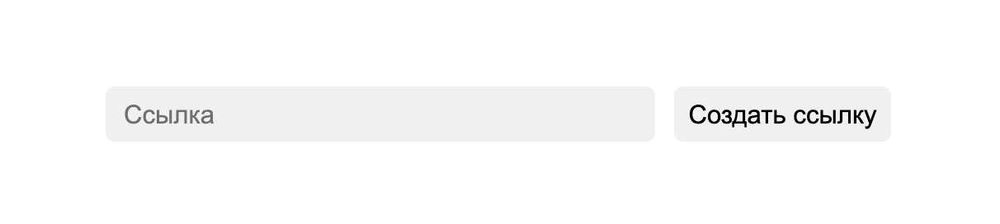
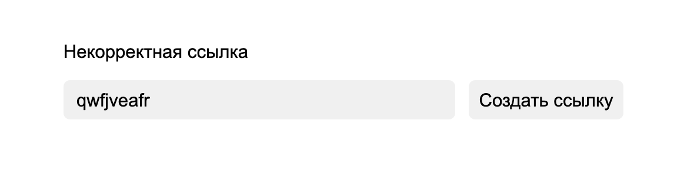
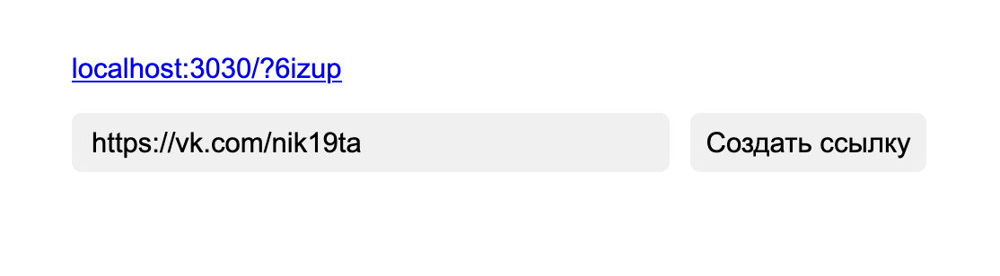

# shorten - Севис по сокращению ссылок с апи

- Первый экран 



- Если в поле введена не корректная ссылка будет ошибка которая выведется на экран



- Когда ссылка введена правильно то сервис выдаёт короткую ссылку по которой при переходе будет редирект




Формат хранения данных такой:

```json
[
    {
        "link": "lol.ru", // ссылка 
        "key": "mSEw8", // ключ, по нему формируется адресс короткой ссылки (протокол+ip сервера+port сервера+ключ)
        "time": "Tue Jan 12 2021 06:41:35 ", // время создания ссылка
        "transitions": 1, // сколько раз переходили по этой ссылки 
        "id": 3 // id ссылки
    }
]
```

## API

1. `/new` - создание новой ссылки
Отправляемые данные
```json
{
    "link": "Какая то ссылка"
}
```
Если ссылка правильная то сервер вернёт короткую ссылку, если же ссылка не правильная то ошибку

2. `/check` - проверка есть ли такая ссылка
Отправляемые данные
```json
{
    "link": "ключ от ссылки"
}
```
Если ссылка на сервере есть в базе данных такая ссылка то он вернёт ключ ссылки, ссылку, сколько переходов было, и id ссылки 
